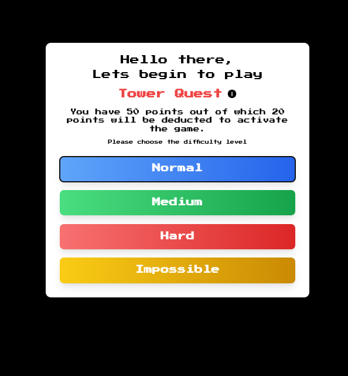
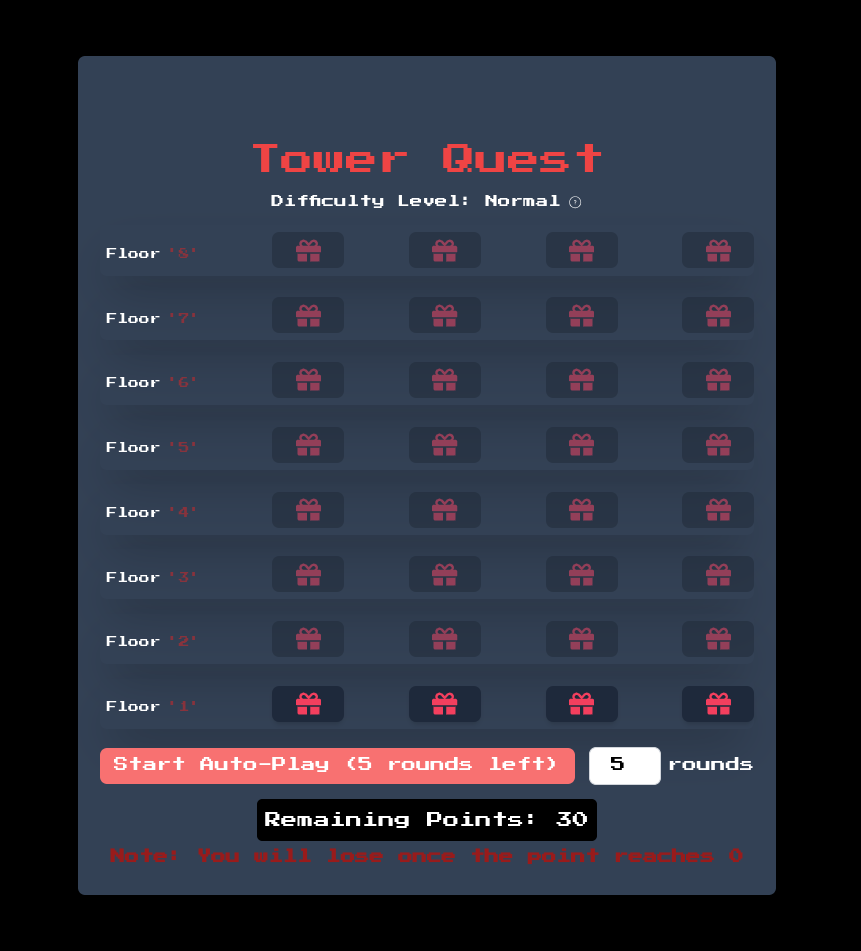
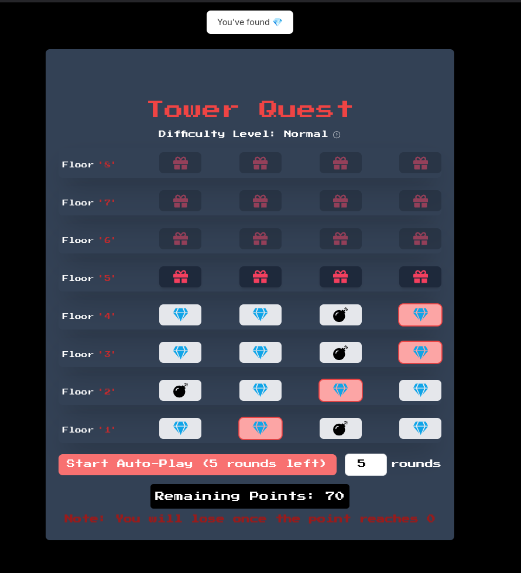
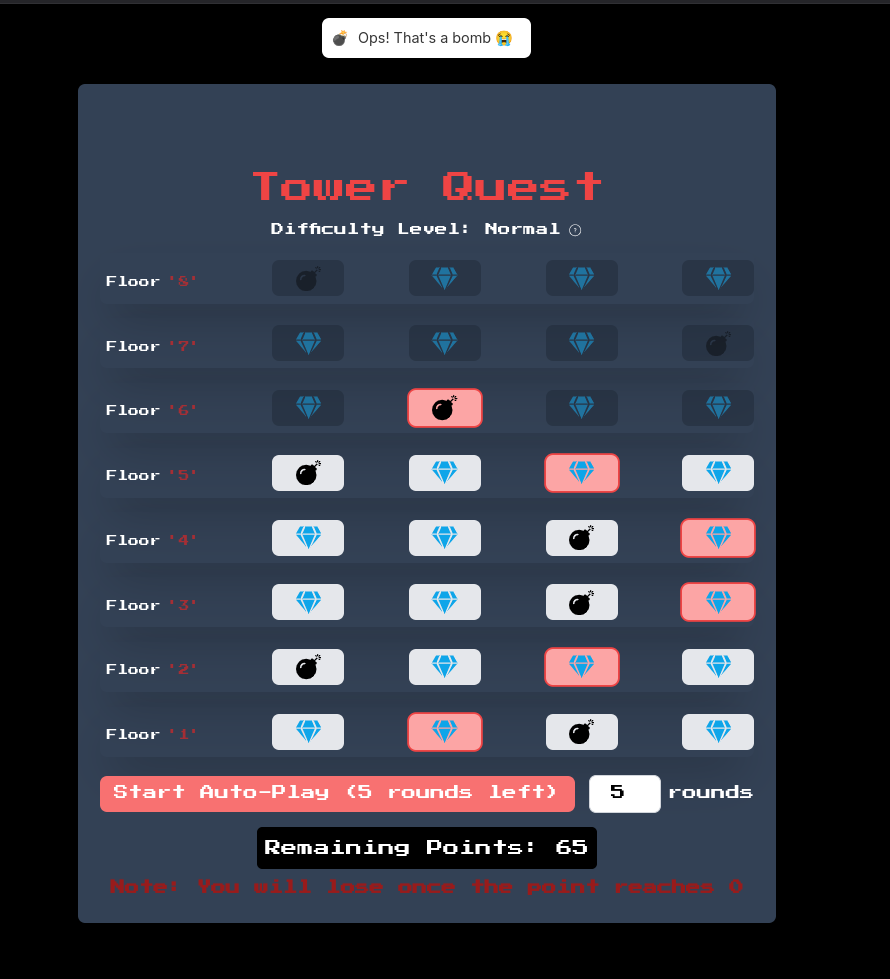

# Game Project

## Overview

This is a simple game project built with React and Howler.js for audio effects.

## Installation

1. **Clone the repository**  
   `git clone https://github.com/rikeshhh/tower_quest.git`

2. **Navigate into the project directory**  
   `cd tower_quest`

3. **Install dependencies**  
   Run the following command to install all necessary dependencies:

   ```bash
   npm install
## Screenshots
Here are some visuals of the project in action:

### Home Page


### Tower Quest


### Gem


### Bomb
